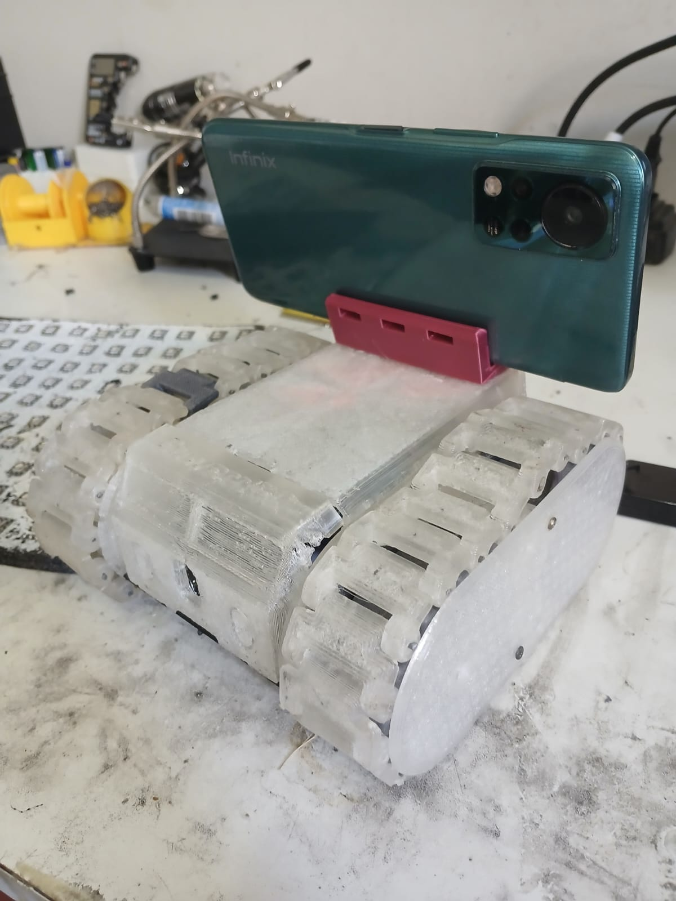

ESP32 Rover 🤖

This is a 3D-printed rover controlled by an ESP32. It uses a simple web page for remote control and a smartphone for the camera and remote access.

How It Works

    The rover is built with 3D-printed parts from this Thingiverse project.

    https://www.thingiverse.com/thing:3671892

    An ESP32 hosts a simple webpage to drive the rover's motors.

    The smartphone acts as the camera and a server. It runs:

        An Nginx reverse proxy to handle requests.

        An IP Camera App to stream video.

        A VPN so you can control the rover from anywhere with a phone signal.

Components

    ESP32

    H-Bridge and 2 Motors

    Batteries for the ESP32 and motors

    Smartphone

This project lets you drive your rover and see its camera feed remotely using your phone as a mobile control hub.

